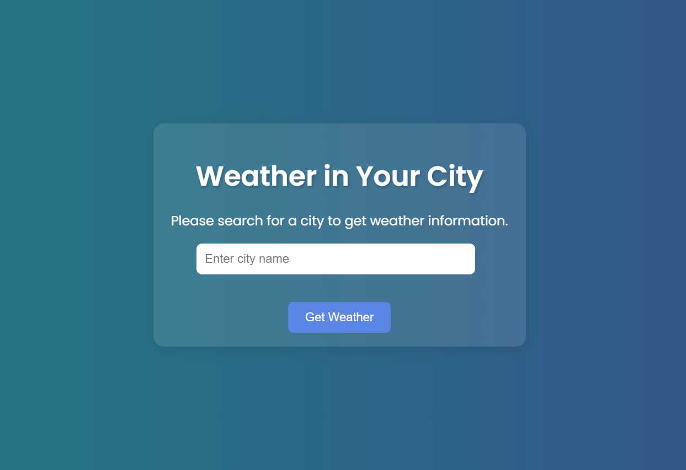

# Modern Weather App Project

This project is a simple weather application built using **Node.js**, **Express**, **EJS**, and **CSS**. It allows users to search for cities, view real-time weather information, and get suggestions (autocomplete) while typing city names. The weather data is fetched from the **OpenWeatherMap** API, and city suggestions are fetched using the **GeoDB** API.

## Table of Contents
- [ScreenShot](#screenshot)
- [Features](#features)
- [Built With](#built-with)
- [Prerequisites](#prerequisites)
- [Installation and Usage](#installation-and-usage)
- [Environment Variables](#environment-variables)
- [Contact](#contact)

## ScreenShot




<p align="right">(<a href="#table-of-contents">back to top</a>)</p>

## Features

- **Weather Search**: Enter a city name to get current weather data, including temperature, wind speed, and an icon representing weather conditions.
- **City Suggestions**: Autocomplete functionality that suggests city names as you type.
- **Responsive Design**: The app is responsive, adapting to various screen sizes.
  
<p align="right">(<a href="#table-of-contents">back to top</a>)</p>

## Built With

This project was built using the following technologies:

* 
* 
* 
* 
* 

<p align="right">(<a href="#table-of-contents">back to top</a>)</p>

## Prerequisites

Before you begin, ensure you have installed the following:

- **Node.js** (version 14.x or higher)
- **npm** (Node Package Manager)

You will also need API keys for:
1. **OpenWeatherMap API** (for weather data)
2. **GeoDB Cities API** (for city suggestions)

<p align="right">(<a href="#table-of-contents">back to top</a>)</p>

## Installation and Usage

### Step 1: Clone the repository
```bash
git clone https://github.com/AmirrezaAhmadi/Weather-App-NodeJs.git
cd WeatherApp
```

### Step 2: Install dependencies
```bash
npm install
```
### Step 3: Set up environment variables

1. In the root directory, there is a file named .env.example. Rename this file to .env:

```bash
mv .env.example .env
```
2. Open the .env file and add your API keys for OpenWeatherMap and GeoDB:

```bash
WEATHER_API_KEY=your_openweathermap_api_key
GEODB_API_KEY=your_geodb_api_key
```

### Step 4: Run the app

```bash
npm start
```
### Step 5: Access the app
Open your browser and go to http://localhost:3000/weather
You can now search for cities and see their weather information.

<p align="right">(<a href="#table-of-contents">back to top</a>)</p>

## Environment Variables

In order to run this project, you need to add your API keys to a .env file. The .env file should look like this:

```bash
WEATHER_API_KEY=your_openweathermap_api_key
GEODB_API_KEY=your_geodb_api_key
```
You can obtain your OpenWeatherMap API Key from https://openweathermap.org/api and your GeoDB API Key from https://rapidapi.com/wirefreethought/api/geodb-cities/.

<p align="right">(<a href="#table-of-contents">back to top</a>)</p>

## Contact

You can reach me through the following:

* Email: AmirrezaAhmadi.GH@Gmail.com
* Telegram: https://t.me/AmirrezaDevelop
* Instagram: https://www.instagram.com/codewithamirreza
* Project Link: https://github.com/AmirrezaAhmadi/Weather-App-NodeJs.git

<p align="right">(<a href="#table-of-contents">back to top</a>)</p>